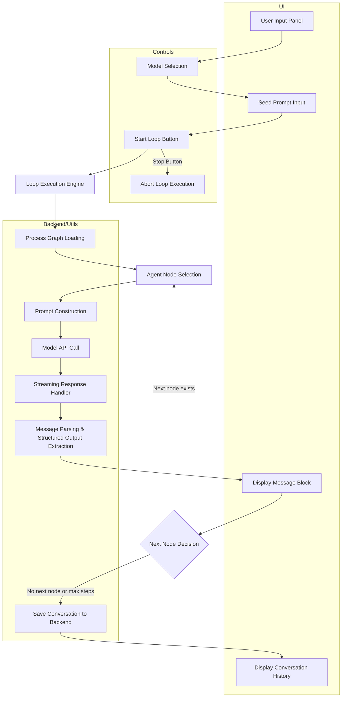

Okay, let's analyze the logic flow of the MetaLoopLab feature based on the provided repository files.

**Core Concept:**

MetaLoopLab is designed as an experimental interface for AI models (agents) to interact in a structured loop, often involving one agent generating ideas and another critiquing them. This process is driven by a pre-defined graph structure.

**Logic Flow Breakdown:**

1.  **Initialization & UI (`MetaLoopLab.js`):**
    * The main component sets up the user interface.
    * It fetches available Ollama and Groq models from the backend API (`/api/models/...`) to populate model selection dropdowns.
    * Users select two models (Model A and Model B) and provide an initial "seed prompt" to start the loop.
    * Controls are available to start/stop the loop and set the maximum number of steps (or run endlessly).

2.  **Process Graph Definition (`processGraph.js`, `model_scap_lessons_and_plan.md`):**
    * A simple, static process graph defines the basic interaction loop.
    * The default graph includes two agent nodes: "Ideation" and "Critic".
    * Edges define the flow: Ideation -> Critic -> Ideation, creating a loop.
    * The "Ideation" node is the entry point.
    * Each node has data specifying its label, backend (currently 'ollama'), and instructions.
    * The Mermaid diagram in `model_scap_lessons_and_plan.md` visually represents this flow.

**(Diagram based on analysis of `model_scap_lessons_and_plan.md`)**

3.  **Loop Execution Engine (`MetaLoopLab.js` - `startLoop` function):**
    * When the user clicks "Start Loop", the engine begins orchestrating the agent interaction.
    * It loads the defined `processGraph`.
    * It determines the current agent node based on the graph's entry point and subsequent transitions.
    * **Prompt Construction:** It dynamically builds a prompt for the current agent, including:
        * Its specific instructions (from `processGraph.js`).
        * The original user `seedPrompt`.
        * Formatted context from previous steps in the loop (`formatPriorContext` function).
    * **Model API Call:** It sends the constructed prompt to the selected Ollama model using the `/v1/chat/completions` endpoint (likely via the proxy defined in `setupProxy.js`). Groq integration is planned but not fully implemented.
    * **Streaming & Display:** It handles the streaming response from Ollama (`WorkspaceOllamaStream`), updating the UI in real-time (`setCurrentStreamMsg`, `MessageBlock`).
    * **Output Parsing:** After receiving the full response, it attempts to extract structured JSON data from the end of the agent's text output using the `extractTrailingJson` utility function. This allows agents to pass structured information or control flow hints (like `next_node`).
    * **History Update:** The agent's response (including the raw text and any extracted structured data) is added to the message history (`displayHistory`, `setMessages`).
    * **Next Node Decision:** It determines the next agent to run based on:
        * A `next_node` field potentially found in the structured output.
        * If no structured direction is found, it follows the default edge defined in `processGraph.js`.
    * The loop continues until the maximum steps are reached, the graph has no further nodes, or the user stops it manually.

4.  **Structured Output Handling (`structuredOutput.js`, `MetaLoopLab.js`):**
    * The system includes utilities (`structuredOutput.js`) for defining schemas and validating structured JSON output from agents.
    * Currently, `MetaLoopLab.js` uses a simpler `extractTrailingJson` function to parse JSON from the end of agent responses, enabling agents to pass data or control flow information.

5.  **Conversation Archiving (`MetaLoopLab.js`):**
    * Upon completion or stopping, the entire loop conversation (seed prompt, messages, graph used) is saved to the backend API endpoint (`/api/loop_conversations/:timestamp`).

6.  **History Display (`LoopHistory.js`):**
    * The `LoopHistory` component (likely used within MetaLoopLab or a parent component) fetches and displays a list of previously saved loop conversations from the backend (`/api/loop_conversations`).

**Integration (`App.js`):**

* MetaLoopLab is integrated as a specific route (`ROUTES.META_LOOP_LAB`) within the application's navigation structure.
* It utilizes the common `AppHeader` for navigation.

In essence, the MetaLoopLab orchestrates a conversation between AI agents based on a predefined process graph, handling prompt construction, API calls (currently Ollama streaming), response display, structured data extraction, and conversation saving.