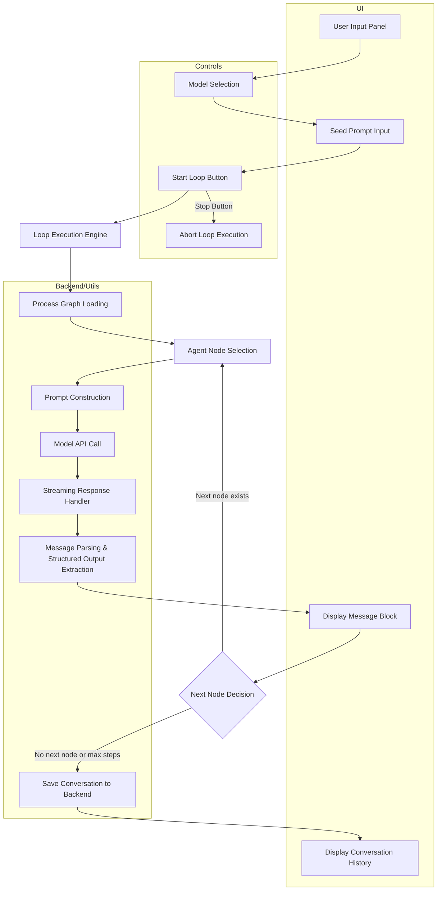

# Model Scap: Lessons Learned and Implementation Blueprint

## Overview
This document synthesizes all major findings, lessons, and actionable insights from our work and experiments with the "Model Scap" concept, as inspired by the outputs in `weird_company.md` and `weir_output_2.md`. It is intended as a comprehensive, practical reference for building the next-generation Model Scap component, ensuring we leverage all prior knowledge and avoid repeating past mistakes.

---

## MetaLoopLab Functional Process Graph and Architectural Mapping



### Detailed Node Descriptions
- **User Input Panel**: UI for selecting providers (Ollama/Groq), models (A/B), and entering the initial seed prompt.
- **Model Selection**: Fetches available models from backend APIs for both providers.
- **Seed Prompt Input**: User enters the scenario/question to initiate the loop.
- **Start Loop Button**: Triggers the loop execution logic with current settings.
- **Loop Execution Engine**: Orchestrates the step-by-step agent conversation based on the process graph.
- **Process Graph Loading**: Loads the process graph (nodes/edges/entry) from configuration.
- **Agent Node Selection**: Chooses the current agent node to act based on graph state.
- **Prompt Construction**: Builds the prompt for the agent, including prior context and system instructions.
- **Model API Call**: Sends prompt to selected LLM provider/model (Ollama or Groq), handles streaming for Ollama.
- **Streaming Response Handler**: Receives and displays partial outputs in real time.
- **Message Parsing & Structured Output Extraction**: Extracts trailing JSON from agent output for structured handoff.
- **Display Message Block**: Renders each agent’s output, including reasoning and structured fields, in the conversation panel.
- **Next Node Decision**: Determines the next agent node (from structured output or process graph edges).
- **Save Conversation to Backend**: Persists the full loop conversation to the backend for history/archive.
- **Display Conversation History**: Shows the entire loop conversation, including streaming and completed messages.
- **Stop Button**: Allows user to abort loop execution at any time, halting all processing.

### Ramifications & Integration Points
- **Process Graph**: The loop is driven by a configurable process graph (`processGraph`), enabling flexible agent workflows.
- **Model APIs**: Integrates with Ollama (streaming) and Groq (planned, not yet implemented).
- **LoopHistory Component**: Used for displaying and selecting past loop conversations.
- **Structured Output**: Supports agents emitting structured JSON for dynamic handoff and next-node selection.
- **Backend Storage**: All completed loops are archived for future retrieval and auditability.
- **UI/UX**: Designed for clarity, extensibility, and real-time feedback.

### Current Limitations / TODOs
- Groq model execution is stubbed/not implemented.
- Role assignment and process graph editing are static (not yet UI-editable).
- Only supports a simple linear or branching process graph as defined in `processGraph`.
- Advanced analytics, optimization controls, and parallel loops are future work.

---

*This section documents the current MetaLoopLab architecture, process, and limitations as of May 2025. Update as the system evolves.*

## 1. Conceptual Foundation
- **Model Scap** is a modular, agent-based, multi-stage reasoning and workflow system.
- Inspired by process graphs (see `weird_company.md`) and multi-level agent interaction (see `weir_output_2.md`).
- Each node (agent) can represent a phase, sub-phase, or technique, with explicit instructions and backend assignment.
- The system supports loops, branching, and context-aware sub-processes.

---

## MetaLoopLab Functional Process Graph and Architectural Mapping


### Detailed Node Descriptions
- **User Input Panel**: UI for selecting providers (Ollama/Groq), models (A/B), and entering the initial seed prompt.
- **Model Selection**: Fetches available models from backend APIs for both providers.
- **Seed Prompt Input**: User enters the scenario/question to initiate the loop.
- **Start Loop Button**: Triggers the loop execution logic with current settings.
- **Loop Execution Engine**: Orchestrates the step-by-step agent conversation based on the process graph.
- **Process Graph Loading**: Loads the process graph (nodes/edges/entry) from configuration.
- **Agent Node Selection**: Chooses the current agent node to act based on graph state.
- **Prompt Construction**: Builds the prompt for the agent, including prior context and system instructions.
- **Model API Call**: Sends prompt to selected LLM provider/model (Ollama or Groq), handles streaming for Ollama.
- **Streaming Response Handler**: Receives and displays partial outputs in real time.
- **Message Parsing & Structured Output Extraction**: Extracts trailing JSON from agent output for structured handoff.
- **Display Message Block**: Renders each agent’s output, including reasoning and structured fields, in the conversation panel.
- **Next Node Decision**: Determines the next agent node (from structured output or process graph edges).
- **Save Conversation to Backend**: Persists the full loop conversation to the backend for history/archive.
- **Display Conversation History**: Shows the entire loop conversation, including streaming and completed messages.
- **Stop Button**: Allows user to abort loop execution at any time, halting all processing.

### Ramifications & Integration Points
- **Process Graph**: The loop is driven by a configurable process graph (`processGraph`), enabling flexible agent workflows.
- **Model APIs**: Integrates with Ollama (streaming) and Groq (planned, not yet implemented).
- **LoopHistory Component**: Used for displaying and selecting past loop conversations.
- **Structured Output**: Supports agents emitting structured JSON for dynamic handoff and next-node selection.
- **Backend Storage**: All completed loops are archived for future retrieval and auditability.
- **UI/UX**: Designed for clarity, extensibility, and real-time feedback.

### Current Limitations / TODOs
- Groq model execution is stubbed/not implemented.
- Role assignment and process graph editing are static (not yet UI-editable).
- Only supports a simple linear or branching process graph as defined in `processGraph`.
- Advanced analytics, optimization controls, and parallel loops are future work.

---

*This section documents the current MetaLoopLab architecture, process, and limitations as of May 2025. Update as the system evolves.*

## 2. Key Lessons Learned
### a. **Explicit Structure is Critical**
- JSON-based node/edge representation allows for clear, extensible process modeling.
- Each agent/node must have:
  - Unique ID
  - Type (agent, edge, etc.)
  - Position (for visualization)
  - Data: label, backend, instructions
- Sub-steps and sub-flows should be explicit, not implicit.

### b. **Multi-Level, Multi-Loop Support**
- The system must handle nested loops and allow for multiple entry/exit points, as in the company process graph.
- Each loop/sub-process can be triggered by outcomes of previous stages (optimization, feedback, etc.).

### c. **Agent Specialization & Context**
- Each agent should have a clear role (ideation, planning, critique, etc.).
- Agents can be specialized by backend (e.g., ollama, groq) and instructions.
- Contextual handoff between agents is essential for continuity.

### d. **User Guidance & Transparency**
- The system should be explainable to non-experts (see narrative in `weird_company.md`).
- Visualizations and step-by-step explanations improve usability.
- Allow users to see and edit the process graph.

### e. **Prompt Engineering & Output Handling**
- Prompts must be clear, context-rich, and tailored to each agent's function.
- Output from one agent should be parsed and normalized before passing to the next.
- Avoid extrapolation or inference not grounded in prompt/context (see `weir_output_2.md`).

### f. **Sequential and Historical Tracking**
- Track each turn/step with prompt and output, maintaining a full history for review, debugging, and optimization.
- Enable replay or rollback of any step.

### g. **Failure Modes & What Not To Do**
- Avoid ambiguous prompt handoffs.
- Do not allow agents to infer beyond their context.
- Show users what not to do (anti-patterns) in the UI and docs.

---

## MetaLoopLab Functional Process Graph and Architectural Mapping


### Detailed Node Descriptions
- **User Input Panel**: UI for selecting providers (Ollama/Groq), models (A/B), and entering the initial seed prompt.
- **Model Selection**: Fetches available models from backend APIs for both providers.
- **Seed Prompt Input**: User enters the scenario/question to initiate the loop.
- **Start Loop Button**: Triggers the loop execution logic with current settings.
- **Loop Execution Engine**: Orchestrates the step-by-step agent conversation based on the process graph.
- **Process Graph Loading**: Loads the process graph (nodes/edges/entry) from configuration.
- **Agent Node Selection**: Chooses the current agent node to act based on graph state.
- **Prompt Construction**: Builds the prompt for the agent, including prior context and system instructions.
- **Model API Call**: Sends prompt to selected LLM provider/model (Ollama or Groq), handles streaming for Ollama.
- **Streaming Response Handler**: Receives and displays partial outputs in real time.
- **Message Parsing & Structured Output Extraction**: Extracts trailing JSON from agent output for structured handoff.
- **Display Message Block**: Renders each agent’s output, including reasoning and structured fields, in the conversation panel.
- **Next Node Decision**: Determines the next agent node (from structured output or process graph edges).
- **Save Conversation to Backend**: Persists the full loop conversation to the backend for history/archive.
- **Display Conversation History**: Shows the entire loop conversation, including streaming and completed messages.
- **Stop Button**: Allows user to abort loop execution at any time, halting all processing.

### Ramifications & Integration Points
- **Process Graph**: The loop is driven by a configurable process graph (`processGraph`), enabling flexible agent workflows.
- **Model APIs**: Integrates with Ollama (streaming) and Groq (planned, not yet implemented).
- **LoopHistory Component**: Used for displaying and selecting past loop conversations.
- **Structured Output**: Supports agents emitting structured JSON for dynamic handoff and next-node selection.
- **Backend Storage**: All completed loops are archived for future retrieval and auditability.
- **UI/UX**: Designed for clarity, extensibility, and real-time feedback.

### Current Limitations / TODOs
- Groq model execution is stubbed/not implemented.
- Role assignment and process graph editing are static (not yet UI-editable).
- Only supports a simple linear or branching process graph as defined in `processGraph`.
- Advanced analytics, optimization controls, and parallel loops are future work.

---

*This section documents the current MetaLoopLab architecture, process, and limitations as of May 2025. Update as the system evolves.*

## 3. Implementation Blueprint
### a. **Data Model**
- Nodes: `{ id, type, position, data: { label, backend, instructions } }`
- Edges: `{ source, target, type, ... }`
- Process graph as a JSON object, editable and visualizable.

### b. **Core Features**
- **Graph Editor UI:** Drag-and-drop, edit nodes/edges, assign roles and instructions.
- **Agent Engine:** Executes each node/agent step-by-step, passing output as context.
- **Prompt/Output Normalization:** Ensure all agent outputs are parsed before next step.
- **History Viewer:** Full log of prompts, outputs, agent transitions.
- **Failure/Anti-pattern Showcase:** UI and docs for common mistakes.

### c. **Extensibility**
- Add new agent types, backends, or process templates easily.
- Allow import/export of graphs and process definitions.

### d. **User Experience**
- Visual, interactive, and transparent.
- Step-by-step mode for education/debugging.
- Exportable documentation for each process/graph.

---

## MetaLoopLab Functional Process Graph and Architectural Mapping


### Detailed Node Descriptions
- **User Input Panel**: UI for selecting providers (Ollama/Groq), models (A/B), and entering the initial seed prompt.
- **Model Selection**: Fetches available models from backend APIs for both providers.
- **Seed Prompt Input**: User enters the scenario/question to initiate the loop.
- **Start Loop Button**: Triggers the loop execution logic with current settings.
- **Loop Execution Engine**: Orchestrates the step-by-step agent conversation based on the process graph.
- **Process Graph Loading**: Loads the process graph (nodes/edges/entry) from configuration.
- **Agent Node Selection**: Chooses the current agent node to act based on graph state.
- **Prompt Construction**: Builds the prompt for the agent, including prior context and system instructions.
- **Model API Call**: Sends prompt to selected LLM provider/model (Ollama or Groq), handles streaming for Ollama.
- **Streaming Response Handler**: Receives and displays partial outputs in real time.
- **Message Parsing & Structured Output Extraction**: Extracts trailing JSON from agent output for structured handoff.
- **Display Message Block**: Renders each agent’s output, including reasoning and structured fields, in the conversation panel.
- **Next Node Decision**: Determines the next agent node (from structured output or process graph edges).
- **Save Conversation to Backend**: Persists the full loop conversation to the backend for history/archive.
- **Display Conversation History**: Shows the entire loop conversation, including streaming and completed messages.
- **Stop Button**: Allows user to abort loop execution at any time, halting all processing.

### Ramifications & Integration Points
- **Process Graph**: The loop is driven by a configurable process graph (`processGraph`), enabling flexible agent workflows.
- **Model APIs**: Integrates with Ollama (streaming) and Groq (planned, not yet implemented).
- **LoopHistory Component**: Used for displaying and selecting past loop conversations.
- **Structured Output**: Supports agents emitting structured JSON for dynamic handoff and next-node selection.
- **Backend Storage**: All completed loops are archived for future retrieval and auditability.
- **UI/UX**: Designed for clarity, extensibility, and real-time feedback.

### Current Limitations / TODOs
- Groq model execution is stubbed/not implemented.
- Role assignment and process graph editing are static (not yet UI-editable).
- Only supports a simple linear or branching process graph as defined in `processGraph`.
- Advanced analytics, optimization controls, and parallel loops are future work.

---

*This section documents the current MetaLoopLab architecture, process, and limitations as of May 2025. Update as the system evolves.*

## 4. Synthesis of Opportunities
- **Rapid Prototyping:** Use Model Scap for fast workflow prototyping in any domain (business, engineering, creative, etc.).
- **Meta-Reasoning:** Enable agents to critique, optimize, or reframe steps dynamically.
- **Education:** Teach complex processes through visual, editable multi-agent graphs.
- **Auditability:** Every decision and transition is logged and can be reviewed.

---

## MetaLoopLab Functional Process Graph and Architectural Mapping


### Detailed Node Descriptions
- **User Input Panel**: UI for selecting providers (Ollama/Groq), models (A/B), and entering the initial seed prompt.
- **Model Selection**: Fetches available models from backend APIs for both providers.
- **Seed Prompt Input**: User enters the scenario/question to initiate the loop.
- **Start Loop Button**: Triggers the loop execution logic with current settings.
- **Loop Execution Engine**: Orchestrates the step-by-step agent conversation based on the process graph.
- **Process Graph Loading**: Loads the process graph (nodes/edges/entry) from configuration.
- **Agent Node Selection**: Chooses the current agent node to act based on graph state.
- **Prompt Construction**: Builds the prompt for the agent, including prior context and system instructions.
- **Model API Call**: Sends prompt to selected LLM provider/model (Ollama or Groq), handles streaming for Ollama.
- **Streaming Response Handler**: Receives and displays partial outputs in real time.
- **Message Parsing & Structured Output Extraction**: Extracts trailing JSON from agent output for structured handoff.
- **Display Message Block**: Renders each agent’s output, including reasoning and structured fields, in the conversation panel.
- **Next Node Decision**: Determines the next agent node (from structured output or process graph edges).
- **Save Conversation to Backend**: Persists the full loop conversation to the backend for history/archive.
- **Display Conversation History**: Shows the entire loop conversation, including streaming and completed messages.
- **Stop Button**: Allows user to abort loop execution at any time, halting all processing.

### Ramifications & Integration Points
- **Process Graph**: The loop is driven by a configurable process graph (`processGraph`), enabling flexible agent workflows.
- **Model APIs**: Integrates with Ollama (streaming) and Groq (planned, not yet implemented).
- **LoopHistory Component**: Used for displaying and selecting past loop conversations.
- **Structured Output**: Supports agents emitting structured JSON for dynamic handoff and next-node selection.
- **Backend Storage**: All completed loops are archived for future retrieval and auditability.
- **UI/UX**: Designed for clarity, extensibility, and real-time feedback.

### Current Limitations / TODOs
- Groq model execution is stubbed/not implemented.
- Role assignment and process graph editing are static (not yet UI-editable).
- Only supports a simple linear or branching process graph as defined in `processGraph`.
- Advanced analytics, optimization controls, and parallel loops are future work.

---

*This section documents the current MetaLoopLab architecture, process, and limitations as of May 2025. Update as the system evolves.*

## 5. Next Steps
1. **Review this document** and add any missing insights.
2. **Use as the canonical reference** for the next Model Scap implementation.
3. **Start with the core data model and graph editor.**
4. **Iterate, test, and document** every new lesson in this file.

---

## MetaLoopLab Functional Process Graph and Architectural Mapping


### Detailed Node Descriptions
- **User Input Panel**: UI for selecting providers (Ollama/Groq), models (A/B), and entering the initial seed prompt.
- **Model Selection**: Fetches available models from backend APIs for both providers.
- **Seed Prompt Input**: User enters the scenario/question to initiate the loop.
- **Start Loop Button**: Triggers the loop execution logic with current settings.
- **Loop Execution Engine**: Orchestrates the step-by-step agent conversation based on the process graph.
- **Process Graph Loading**: Loads the process graph (nodes/edges/entry) from configuration.
- **Agent Node Selection**: Chooses the current agent node to act based on graph state.
- **Prompt Construction**: Builds the prompt for the agent, including prior context and system instructions.
- **Model API Call**: Sends prompt to selected LLM provider/model (Ollama or Groq), handles streaming for Ollama.
- **Streaming Response Handler**: Receives and displays partial outputs in real time.
- **Message Parsing & Structured Output Extraction**: Extracts trailing JSON from agent output for structured handoff.
- **Display Message Block**: Renders each agent’s output, including reasoning and structured fields, in the conversation panel.
- **Next Node Decision**: Determines the next agent node (from structured output or process graph edges).
- **Save Conversation to Backend**: Persists the full loop conversation to the backend for history/archive.
- **Display Conversation History**: Shows the entire loop conversation, including streaming and completed messages.
- **Stop Button**: Allows user to abort loop execution at any time, halting all processing.

### Ramifications & Integration Points
- **Process Graph**: The loop is driven by a configurable process graph (`processGraph`), enabling flexible agent workflows.
- **Model APIs**: Integrates with Ollama (streaming) and Groq (planned, not yet implemented).
- **LoopHistory Component**: Used for displaying and selecting past loop conversations.
- **Structured Output**: Supports agents emitting structured JSON for dynamic handoff and next-node selection.
- **Backend Storage**: All completed loops are archived for future retrieval and auditability.
- **UI/UX**: Designed for clarity, extensibility, and real-time feedback.

### Current Limitations / TODOs
- Groq model execution is stubbed/not implemented.
- Role assignment and process graph editing are static (not yet UI-editable).
- Only supports a simple linear or branching process graph as defined in `processGraph`.
- Advanced analytics, optimization controls, and parallel loops are future work.

---

*This section documents the current MetaLoopLab architecture, process, and limitations as of May 2025. Update as the system evolves.*

## 6. Appendix: Key Anti-Patterns
- Agents inferring beyond their prompt/context.
- Implicit or hidden process steps.
- Loss of turn-by-turn history.
- Non-transparent handoffs between agents.

---

## MetaLoopLab Functional Process Graph and Architectural Mapping


### Detailed Node Descriptions
- **User Input Panel**: UI for selecting providers (Ollama/Groq), models (A/B), and entering the initial seed prompt.
- **Model Selection**: Fetches available models from backend APIs for both providers.
- **Seed Prompt Input**: User enters the scenario/question to initiate the loop.
- **Start Loop Button**: Triggers the loop execution logic with current settings.
- **Loop Execution Engine**: Orchestrates the step-by-step agent conversation based on the process graph.
- **Process Graph Loading**: Loads the process graph (nodes/edges/entry) from configuration.
- **Agent Node Selection**: Chooses the current agent node to act based on graph state.
- **Prompt Construction**: Builds the prompt for the agent, including prior context and system instructions.
- **Model API Call**: Sends prompt to selected LLM provider/model (Ollama or Groq), handles streaming for Ollama.
- **Streaming Response Handler**: Receives and displays partial outputs in real time.
- **Message Parsing & Structured Output Extraction**: Extracts trailing JSON from agent output for structured handoff.
- **Display Message Block**: Renders each agent’s output, including reasoning and structured fields, in the conversation panel.
- **Next Node Decision**: Determines the next agent node (from structured output or process graph edges).
- **Save Conversation to Backend**: Persists the full loop conversation to the backend for history/archive.
- **Display Conversation History**: Shows the entire loop conversation, including streaming and completed messages.
- **Stop Button**: Allows user to abort loop execution at any time, halting all processing.

### Ramifications & Integration Points
- **Process Graph**: The loop is driven by a configurable process graph (`processGraph`), enabling flexible agent workflows.
- **Model APIs**: Integrates with Ollama (streaming) and Groq (planned, not yet implemented).
- **LoopHistory Component**: Used for displaying and selecting past loop conversations.
- **Structured Output**: Supports agents emitting structured JSON for dynamic handoff and next-node selection.
- **Backend Storage**: All completed loops are archived for future retrieval and auditability.
- **UI/UX**: Designed for clarity, extensibility, and real-time feedback.

### Current Limitations / TODOs
- Groq model execution is stubbed/not implemented.
- Role assignment and process graph editing are static (not yet UI-editable).
- Only supports a simple linear or branching process graph as defined in `processGraph`.
- Advanced analytics, optimization controls, and parallel loops are future work.

---

*This section documents the current MetaLoopLab architecture, process, and limitations as of May 2025. Update as the system evolves.*

## 7. Expanded Case Studies & Examples

### 7.1. Example: Company Creation Process (from `weird_company.md`)

#### JSON Structure (Excerpt)
```json
{
  "nodes": [
    { "id": "start", "type": "agent", "data": { "label": "Ideation & Validation", "backend": "ollama", "instructions": "Conduct idea generation and market research to validate the company concept." } },
    { "id": "planning_preparation", "type": "agent", "data": { "label": "Planning & Preparation", "backend": "ollama", "instructions": "Develop business plan and financial projections; establish legal structure." } },
    ...
  ]
}
```

#### How the Model Scaped (Key Observations)
- **Multi-Agent, Multi-Stage:** Each node represents a distinct agent with a clear role (e.g., Ideation, Planning, Development, Launch, Optimization).
- **Explicit Sub-Steps:** Each main stage has a sub-step node (e.g., `ideation_validation_substeps`), making the process granular and traceable.
- **Transitions & Feedback Loops:** Edges/nodes like `optimization_sustainability_to_ideation_validation_substeps` show how the process loops back for continuous improvement.
- **Parallel & Nested Flows:** Multiple sub-step loops can run in parallel, and transitions can be triggered by outcomes (e.g., optimization results).
- **Human-Like Explanation:** The document narrates the process in simple terms—"start", "in-between", "end"—making it accessible to non-experts.

##### Example Narrative:
> "Imagine we have several different tasks that need to be done in a specific order. Each task can also start another smaller set of related work once it's finished, creating even more detailed steps within it..."

##### Lessons Learned:
- Model Scap must support:
  - Explicit sub-flows and sub-steps
  - Multiple entry and exit points
  - Feedback loops for optimization
  - Human-readable explanations for transparency

### 7.2. Example: Multi-Level Reasoning (from `weir_output_2.md`)

#### JSON Structure (Excerpt)
```json
{
  "nodes": [
    { "id": "start", "type": "agent", "data": { "label": "Clarify the Prompt", "backend": "ollama", "instructions": "Ask 'What is the essence?' and Break down into components." } },
    { "id": "level1techniques", "type": "agent", "data": { "label": "Techniques for Level 1", "backend": "ollama", "instructions": "Focus on core problems and identify interdependencies." } },
    ...
  ]
}
```

#### How the Model Scaped (Key Observations)
- **Layered Reasoning:** Each "level" (1–5) represents a deeper or more abstract reasoning step, each with its own agent and techniques.
- **Aha Moments:** Dedicated nodes for "Aha Moments" at each level show how insight is explicitly modeled.
- **Techniques & Edges:** Edges like `level1to2edge` and `level2to3edge` represent transitions from clarity to reframing to synthesis, etc.
- **Contextual Prompts:** Each agent receives a tailored prompt, and outputs are strictly passed along—no extrapolation or implicit inference.

##### Example Narrative:
> "You are to track each turn using the provided prompt only as context for further turns with no extrapolation from previous data..."

##### Lessons Learned:
- Model Scap must enforce:
  - Strict context passing (no hidden state)
  - Explicit transitions between reasoning levels
  - Logging of every turn and agent output

### 7.3. Anti-Patterns in Action
- **Implicit Steps:** If a node's output is used by another without explicit connection, the process breaks down (hidden state).
- **Over-Inference:** If an agent infers beyond its prompt/context, the system produces misleading or non-reproducible results.
- **History Loss:** Failing to track each step/turn makes debugging and optimization impossible.

### 7.4. Creative Generation & Edge Cases
- **Meta-Reasoning:** Agents can critique or optimize previous steps, but only if the handoff is explicit and context is preserved.
- **Failure Handling:** Show how the system should respond if a prompt is unclear, or if an agent produces an invalid output (e.g., prompt for clarification or restart the loop).

---

## MetaLoopLab Functional Process Graph and Architectural Mapping


### Detailed Node Descriptions
- **User Input Panel**: UI for selecting providers (Ollama/Groq), models (A/B), and entering the initial seed prompt.
- **Model Selection**: Fetches available models from backend APIs for both providers.
- **Seed Prompt Input**: User enters the scenario/question to initiate the loop.
- **Start Loop Button**: Triggers the loop execution logic with current settings.
- **Loop Execution Engine**: Orchestrates the step-by-step agent conversation based on the process graph.
- **Process Graph Loading**: Loads the process graph (nodes/edges/entry) from configuration.
- **Agent Node Selection**: Chooses the current agent node to act based on graph state.
- **Prompt Construction**: Builds the prompt for the agent, including prior context and system instructions.
- **Model API Call**: Sends prompt to selected LLM provider/model (Ollama or Groq), handles streaming for Ollama.
- **Streaming Response Handler**: Receives and displays partial outputs in real time.
- **Message Parsing & Structured Output Extraction**: Extracts trailing JSON from agent output for structured handoff.
- **Display Message Block**: Renders each agent’s output, including reasoning and structured fields, in the conversation panel.
- **Next Node Decision**: Determines the next agent node (from structured output or process graph edges).
- **Save Conversation to Backend**: Persists the full loop conversation to the backend for history/archive.
- **Display Conversation History**: Shows the entire loop conversation, including streaming and completed messages.
- **Stop Button**: Allows user to abort loop execution at any time, halting all processing.

### Ramifications & Integration Points
- **Process Graph**: The loop is driven by a configurable process graph (`processGraph`), enabling flexible agent workflows.
- **Model APIs**: Integrates with Ollama (streaming) and Groq (planned, not yet implemented).
- **LoopHistory Component**: Used for displaying and selecting past loop conversations.
- **Structured Output**: Supports agents emitting structured JSON for dynamic handoff and next-node selection.
- **Backend Storage**: All completed loops are archived for future retrieval and auditability.
- **UI/UX**: Designed for clarity, extensibility, and real-time feedback.

### Current Limitations / TODOs
- Groq model execution is stubbed/not implemented.
- Role assignment and process graph editing are static (not yet UI-editable).
- Only supports a simple linear or branching process graph as defined in `processGraph`.
- Advanced analytics, optimization controls, and parallel loops are future work.

---

*This section documents the current MetaLoopLab architecture, process, and limitations as of May 2025. Update as the system evolves.*

## 8. Full Example: Model Scap in Action

Below is a synthesized, annotated example of a Model Scap process, combining insights from both documents:

```json
{
  "nodes": [
    { "id": "start", "type": "agent", "data": { "label": "Clarify the Prompt", "backend": "ollama", "instructions": "Break down the user's input into core components." } },
    { "id": "level1", "type": "agent", "data": { "label": "Level 1: Identify Core Issues", "backend": "ollama", "instructions": "Focus on the main problem and dependencies." } },
    { "id": "level2", "type": "agent", "data": { "label": "Level 2: Reframe Problem", "backend": "ollama", "instructions": "Challenge assumptions; use analogies." } },
    { "id": "level3", "type": "agent", "data": { "label": "Level 3: Synthesize Solutions", "backend": "ollama", "instructions": "Combine concepts for new perspectives." } },
    { "id": "meta_critic", "type": "agent", "data": { "label": "Meta-Critic", "backend": "ollama", "instructions": "Critique previous outputs and suggest optimizations." } }
  ],
  "edges": [
    { "source": "start", "target": "level1" },
    { "source": "level1", "target": "level2" },
    { "source": "level2", "target": "level3" },
    { "source": "level3", "target": "meta_critic" },
    { "source": "meta_critic", "target": "level1" } // Feedback loop
  ]
}
```

**Annotation:**
- Each agent is a node with explicit instructions and backend.
- Edges define the flow, including feedback loops.
- Context is strictly passed from node to node; no hidden state.
- Every turn is logged for traceability.

---

## MetaLoopLab Functional Process Graph and Architectural Mapping


### Detailed Node Descriptions
- **User Input Panel**: UI for selecting providers (Ollama/Groq), models (A/B), and entering the initial seed prompt.
- **Model Selection**: Fetches available models from backend APIs for both providers.
- **Seed Prompt Input**: User enters the scenario/question to initiate the loop.
- **Start Loop Button**: Triggers the loop execution logic with current settings.
- **Loop Execution Engine**: Orchestrates the step-by-step agent conversation based on the process graph.
- **Process Graph Loading**: Loads the process graph (nodes/edges/entry) from configuration.
- **Agent Node Selection**: Chooses the current agent node to act based on graph state.
- **Prompt Construction**: Builds the prompt for the agent, including prior context and system instructions.
- **Model API Call**: Sends prompt to selected LLM provider/model (Ollama or Groq), handles streaming for Ollama.
- **Streaming Response Handler**: Receives and displays partial outputs in real time.
- **Message Parsing & Structured Output Extraction**: Extracts trailing JSON from agent output for structured handoff.
- **Display Message Block**: Renders each agent’s output, including reasoning and structured fields, in the conversation panel.
- **Next Node Decision**: Determines the next agent node (from structured output or process graph edges).
- **Save Conversation to Backend**: Persists the full loop conversation to the backend for history/archive.
- **Display Conversation History**: Shows the entire loop conversation, including streaming and completed messages.
- **Stop Button**: Allows user to abort loop execution at any time, halting all processing.

### Ramifications & Integration Points
- **Process Graph**: The loop is driven by a configurable process graph (`processGraph`), enabling flexible agent workflows.
- **Model APIs**: Integrates with Ollama (streaming) and Groq (planned, not yet implemented).
- **LoopHistory Component**: Used for displaying and selecting past loop conversations.
- **Structured Output**: Supports agents emitting structured JSON for dynamic handoff and next-node selection.
- **Backend Storage**: All completed loops are archived for future retrieval and auditability.
- **UI/UX**: Designed for clarity, extensibility, and real-time feedback.

### Current Limitations / TODOs
- Groq model execution is stubbed/not implemented.
- Role assignment and process graph editing are static (not yet UI-editable).
- Only supports a simple linear or branching process graph as defined in `processGraph`.
- Advanced analytics, optimization controls, and parallel loops are future work.

---

*This section documents the current MetaLoopLab architecture, process, and limitations as of May 2025. Update as the system evolves.*

## 9. Summary Table: Steps Completed (2025-05-07)

| Step | Description                                               | Implementation Highlights                                                                 | Status   | Lessons Learned / Notes |
|------|-----------------------------------------------------------|------------------------------------------------------------------------------------------|----------|------------------------|
| 1    | **Process Graph Architecture**                            | JSON-based nodes/edges; explicit agent roles, entry, and looping                         | Complete | Enables auditability, extensibility |
| 2    | **Contextual Handoff & Chaining**                         | Agents receive full prior context; dynamic prompt construction; structured/free-form output | Complete | Context-rich, no hidden state |
| 3    | **Robust Trailing JSON Extraction**                       | Utility to extract last valid JSON; ignores code blocks and <think> tags                 | Complete | Handles mixed output, prevents parse errors |
| 4    | **UI: Reasoning + Structured Output**                     | UI shows agent, model, reasoning, all structured fields in sequence; expandable messages  | Complete | Auditable, user-friendly, supports arbitrary graphs |
| 5    | **Testing & Validation**                                  | Manual and planned automated tests for graph execution, JSON extraction, UI edge cases    | In Progress | Need more automated tests, edge case docs |

---

## MetaLoopLab Functional Process Graph and Architectural Mapping


### Detailed Node Descriptions
- **User Input Panel**: UI for selecting providers (Ollama/Groq), models (A/B), and entering the initial seed prompt.
- **Model Selection**: Fetches available models from backend APIs for both providers.
- **Seed Prompt Input**: User enters the scenario/question to initiate the loop.
- **Start Loop Button**: Triggers the loop execution logic with current settings.
- **Loop Execution Engine**: Orchestrates the step-by-step agent conversation based on the process graph.
- **Process Graph Loading**: Loads the process graph (nodes/edges/entry) from configuration.
- **Agent Node Selection**: Chooses the current agent node to act based on graph state.
- **Prompt Construction**: Builds the prompt for the agent, including prior context and system instructions.
- **Model API Call**: Sends prompt to selected LLM provider/model (Ollama or Groq), handles streaming for Ollama.
- **Streaming Response Handler**: Receives and displays partial outputs in real time.
- **Message Parsing & Structured Output Extraction**: Extracts trailing JSON from agent output for structured handoff.
- **Display Message Block**: Renders each agent’s output, including reasoning and structured fields, in the conversation panel.
- **Next Node Decision**: Determines the next agent node (from structured output or process graph edges).
- **Save Conversation to Backend**: Persists the full loop conversation to the backend for history/archive.
- **Display Conversation History**: Shows the entire loop conversation, including streaming and completed messages.
- **Stop Button**: Allows user to abort loop execution at any time, halting all processing.

### Ramifications & Integration Points
- **Process Graph**: The loop is driven by a configurable process graph (`processGraph`), enabling flexible agent workflows.
- **Model APIs**: Integrates with Ollama (streaming) and Groq (planned, not yet implemented).
- **LoopHistory Component**: Used for displaying and selecting past loop conversations.
- **Structured Output**: Supports agents emitting structured JSON for dynamic handoff and next-node selection.
- **Backend Storage**: All completed loops are archived for future retrieval and auditability.
- **UI/UX**: Designed for clarity, extensibility, and real-time feedback.

### Current Limitations / TODOs
- Groq model execution is stubbed/not implemented.
- Role assignment and process graph editing are static (not yet UI-editable).
- Only supports a simple linear or branching process graph as defined in `processGraph`.
- Advanced analytics, optimization controls, and parallel loops are future work.

---

*This section documents the current MetaLoopLab architecture, process, and limitations as of May 2025. Update as the system evolves.*

## 10. Expanded Foresight Table: Future Steps & Opportunities

| Future Step | Description | Key Features/Goals | Risks / Open Questions | Priority |
|-------------|-------------|--------------------|-----------------------|----------|
| 6. Automated Testing & CI | Build robust unit/integration tests for all core logic (graph runner, JSON extraction, UI) | CI pipeline, coverage for all agent/graph/edge cases | Test maintenance, mocking multi-agent flows | High |
| 7. Visual Graph Editor | Interactive graph editor for nodes/edges, drag-and-drop, live process editing | Visual node/edge editing, validation, import/export | UI complexity, user error handling | High |
| 8. Advanced Error Handling & Recovery | Graceful handling of agent/model failures, malformed output, user intervention | Retry, prompt for clarification, anti-pattern warnings | Complexity, UX clarity | High |
| 9. Branching & Sub-Processes | Support for non-linear graphs: branching, sub-flows, nested loops | Arbitrary DAGs, sub-process UI, context merging | Context explosion, debugging | Medium |
| 10. Meta-Reasoning & Self-Optimization | Agents that critique, optimize, or reframe process steps dynamically | Meta-critic nodes, dynamic graph mutation | Infinite loops, loss of transparency | Medium |
| 11. User-Editable Templates & Sharing | Save, load, and share process graph templates | Template library, import/export, versioning | Security, template sprawl | Medium |
| 12. Step-by-Step Replay & Audit | Replay any loop, rollback steps, export full audit logs | Replay UI, exportable logs, diff viewer | Storage, UI complexity | Medium |
| 13. Multi-Backend & Model Orchestration | Assign different backends/models per agent; cross-provider workflows | Per-node backend selection, hybrid runs | API drift, provider limits | Medium |
| 14. Education & Documentation Mode | Guided walkthroughs, inline explanations, anti-pattern showcases | Step-by-step mode, docs export | Content maintenance | Low |
| 15. Real-Time Collaboration | Multi-user editing and process execution | Live sync, conflict resolution | Sync bugs, permissions | Low |
| 16. Domain-Specific Extensions | Plug-ins for business, creative, engineering, etc. | Extension API, domain templates | Fragmentation, support burden | Low |

---

## MetaLoopLab Functional Process Graph and Architectural Mapping


### Detailed Node Descriptions
- **User Input Panel**: UI for selecting providers (Ollama/Groq), models (A/B), and entering the initial seed prompt.
- **Model Selection**: Fetches available models from backend APIs for both providers.
- **Seed Prompt Input**: User enters the scenario/question to initiate the loop.
- **Start Loop Button**: Triggers the loop execution logic with current settings.
- **Loop Execution Engine**: Orchestrates the step-by-step agent conversation based on the process graph.
- **Process Graph Loading**: Loads the process graph (nodes/edges/entry) from configuration.
- **Agent Node Selection**: Chooses the current agent node to act based on graph state.
- **Prompt Construction**: Builds the prompt for the agent, including prior context and system instructions.
- **Model API Call**: Sends prompt to selected LLM provider/model (Ollama or Groq), handles streaming for Ollama.
- **Streaming Response Handler**: Receives and displays partial outputs in real time.
- **Message Parsing & Structured Output Extraction**: Extracts trailing JSON from agent output for structured handoff.
- **Display Message Block**: Renders each agent’s output, including reasoning and structured fields, in the conversation panel.
- **Next Node Decision**: Determines the next agent node (from structured output or process graph edges).
- **Save Conversation to Backend**: Persists the full loop conversation to the backend for history/archive.
- **Display Conversation History**: Shows the entire loop conversation, including streaming and completed messages.
- **Stop Button**: Allows user to abort loop execution at any time, halting all processing.

### Ramifications & Integration Points
- **Process Graph**: The loop is driven by a configurable process graph (`processGraph`), enabling flexible agent workflows.
- **Model APIs**: Integrates with Ollama (streaming) and Groq (planned, not yet implemented).
- **LoopHistory Component**: Used for displaying and selecting past loop conversations.
- **Structured Output**: Supports agents emitting structured JSON for dynamic handoff and next-node selection.
- **Backend Storage**: All completed loops are archived for future retrieval and auditability.
- **UI/UX**: Designed for clarity, extensibility, and real-time feedback.

### Current Limitations / TODOs
- Groq model execution is stubbed/not implemented.
- Role assignment and process graph editing are static (not yet UI-editable).
- Only supports a simple linear or branching process graph as defined in `processGraph`.
- Advanced analytics, optimization controls, and parallel loops are future work.

---

*This section documents the current MetaLoopLab architecture, process, and limitations as of May 2025. Update as the system evolves.*

> **This table is a living roadmap.**
> Update after every major milestone, and use it to prioritize, delegate, and communicate progress.

---

## MetaLoopLab Functional Process Graph and Architectural Mapping


### Detailed Node Descriptions
- **User Input Panel**: UI for selecting providers (Ollama/Groq), models (A/B), and entering the initial seed prompt.
- **Model Selection**: Fetches available models from backend APIs for both providers.
- **Seed Prompt Input**: User enters the scenario/question to initiate the loop.
- **Start Loop Button**: Triggers the loop execution logic with current settings.
- **Loop Execution Engine**: Orchestrates the step-by-step agent conversation based on the process graph.
- **Process Graph Loading**: Loads the process graph (nodes/edges/entry) from configuration.
- **Agent Node Selection**: Chooses the current agent node to act based on graph state.
- **Prompt Construction**: Builds the prompt for the agent, including prior context and system instructions.
- **Model API Call**: Sends prompt to selected LLM provider/model (Ollama or Groq), handles streaming for Ollama.
- **Streaming Response Handler**: Receives and displays partial outputs in real time.
- **Message Parsing & Structured Output Extraction**: Extracts trailing JSON from agent output for structured handoff.
- **Display Message Block**: Renders each agent’s output, including reasoning and structured fields, in the conversation panel.
- **Next Node Decision**: Determines the next agent node (from structured output or process graph edges).
- **Save Conversation to Backend**: Persists the full loop conversation to the backend for history/archive.
- **Display Conversation History**: Shows the entire loop conversation, including streaming and completed messages.
- **Stop Button**: Allows user to abort loop execution at any time, halting all processing.

### Ramifications & Integration Points
- **Process Graph**: The loop is driven by a configurable process graph (`processGraph`), enabling flexible agent workflows.
- **Model APIs**: Integrates with Ollama (streaming) and Groq (planned, not yet implemented).
- **LoopHistory Component**: Used for displaying and selecting past loop conversations.
- **Structured Output**: Supports agents emitting structured JSON for dynamic handoff and next-node selection.
- **Backend Storage**: All completed loops are archived for future retrieval and auditability.
- **UI/UX**: Designed for clarity, extensibility, and real-time feedback.

### Current Limitations / TODOs
- Groq model execution is stubbed/not implemented.
- Role assignment and process graph editing are static (not yet UI-editable).
- Only supports a simple linear or branching process graph as defined in `processGraph`.
- Advanced analytics, optimization controls, and parallel loops are future work.

---

*This section documents the current MetaLoopLab architecture, process, and limitations as of May 2025. Update as the system evolves.*

## 9. Next Steps: MetaLoopLab Scape Discovery Expansion (May 2025)

This section outlines the concrete steps we will take to transform MetaLoopLab into a marvel of scape discovery, integrating all lessons, anti-patterns, and opportunities from prior work. Each step is designed to be iterative, testable, and extensible.

### 9.1. Establish the Core Process Graph Data Model
- Define a JSON schema for nodes (agents) and edges (transitions), supporting:
  - Unique IDs, types, positions, and explicit data (label, backend, instructions)
  - Sub-flows, nested loops, and multi-stage processes
- Include validation logic to prevent hidden state, ambiguous handoffs, or history loss
- Document the schema with examples and anti-patterns

### 9.2. Prototype a Minimal Graph Editor UI
- Integrate a visual graph editor (e.g., using React Flow or similar) in MetaLoopLab
- Enable drag-and-drop creation and editing of nodes and edges
- Allow users to assign roles, instructions, and backends to each agent/node
- Provide UI for visualizing nested loops and feedback edges

### 9.3. Refactor Agent Execution Logic for Graph-Based Traversal
- Replace the current linear loop with traversal of the process graph
- Implement step-by-step agent execution, passing normalized output as context
- Enforce strict context passing and prevent implicit inference
- Add error handling for invalid outputs, ambiguous transitions, or unclear prompts

### 9.4. Implement Sequential History & Replay System
- Log every prompt, output, agent transition, and user intervention
- Expose a history viewer in the UI, allowing replay and rollback of any step
- Ensure auditability and transparency for all process flows

### 9.5. Enhance User Experience for Transparency and Education
- Add tooltips, inline documentation, and step-by-step explanations for each agent/node
- Provide exportable process graphs and logs (JSON, Markdown)
- Offer a guided mode for educational walkthroughs of complex processes

### 9.6. Iterative Testing, Documentation, and Anti-Pattern Safeguards
- Test each new feature for anti-patterns (hidden state, over-inference, history loss)
- Document lessons learned and update this plan as new insights emerge
- Showcase failure modes and recovery mechanisms in both UI and docs

### 9.7. Extensibility and Community Contribution
- Allow for easy addition of new agent types, backends, or process templates
- Enable import/export of user-created graphs and workflows
- Invite feedback, contributions, and case studies from users and collaborators

---

## MetaLoopLab Functional Process Graph and Architectural Mapping


### Detailed Node Descriptions
- **User Input Panel**: UI for selecting providers (Ollama/Groq), models (A/B), and entering the initial seed prompt.
- **Model Selection**: Fetches available models from backend APIs for both providers.
- **Seed Prompt Input**: User enters the scenario/question to initiate the loop.
- **Start Loop Button**: Triggers the loop execution logic with current settings.
- **Loop Execution Engine**: Orchestrates the step-by-step agent conversation based on the process graph.
- **Process Graph Loading**: Loads the process graph (nodes/edges/entry) from configuration.
- **Agent Node Selection**: Chooses the current agent node to act based on graph state.
- **Prompt Construction**: Builds the prompt for the agent, including prior context and system instructions.
- **Model API Call**: Sends prompt to selected LLM provider/model (Ollama or Groq), handles streaming for Ollama.
- **Streaming Response Handler**: Receives and displays partial outputs in real time.
- **Message Parsing & Structured Output Extraction**: Extracts trailing JSON from agent output for structured handoff.
- **Display Message Block**: Renders each agent’s output, including reasoning and structured fields, in the conversation panel.
- **Next Node Decision**: Determines the next agent node (from structured output or process graph edges).
- **Save Conversation to Backend**: Persists the full loop conversation to the backend for history/archive.
- **Display Conversation History**: Shows the entire loop conversation, including streaming and completed messages.
- **Stop Button**: Allows user to abort loop execution at any time, halting all processing.

### Ramifications & Integration Points
- **Process Graph**: The loop is driven by a configurable process graph (`processGraph`), enabling flexible agent workflows.
- **Model APIs**: Integrates with Ollama (streaming) and Groq (planned, not yet implemented).
- **LoopHistory Component**: Used for displaying and selecting past loop conversations.
- **Structured Output**: Supports agents emitting structured JSON for dynamic handoff and next-node selection.
- **Backend Storage**: All completed loops are archived for future retrieval and auditability.
- **UI/UX**: Designed for clarity, extensibility, and real-time feedback.

### Current Limitations / TODOs
- Groq model execution is stubbed/not implemented.
- Role assignment and process graph editing are static (not yet UI-editable).
- Only supports a simple linear or branching process graph as defined in `processGraph`.
- Advanced analytics, optimization controls, and parallel loops are future work.

---

*This section documents the current MetaLoopLab architecture, process, and limitations as of May 2025. Update as the system evolves.*

**Milestone Goal:**
By following these steps, MetaLoopLab will become a fully modular, visual, and extensible platform for scape discovery, enabling rapid prototyping, meta-reasoning, and transparent multi-agent workflows—all grounded in the explicit, auditable, and educational principles outlined in this document.

---

## MetaLoopLab Functional Process Graph and Architectural Mapping


### Detailed Node Descriptions
- **User Input Panel**: UI for selecting providers (Ollama/Groq), models (A/B), and entering the initial seed prompt.
- **Model Selection**: Fetches available models from backend APIs for both providers.
- **Seed Prompt Input**: User enters the scenario/question to initiate the loop.
- **Start Loop Button**: Triggers the loop execution logic with current settings.
- **Loop Execution Engine**: Orchestrates the step-by-step agent conversation based on the process graph.
- **Process Graph Loading**: Loads the process graph (nodes/edges/entry) from configuration.
- **Agent Node Selection**: Chooses the current agent node to act based on graph state.
- **Prompt Construction**: Builds the prompt for the agent, including prior context and system instructions.
- **Model API Call**: Sends prompt to selected LLM provider/model (Ollama or Groq), handles streaming for Ollama.
- **Streaming Response Handler**: Receives and displays partial outputs in real time.
- **Message Parsing & Structured Output Extraction**: Extracts trailing JSON from agent output for structured handoff.
- **Display Message Block**: Renders each agent’s output, including reasoning and structured fields, in the conversation panel.
- **Next Node Decision**: Determines the next agent node (from structured output or process graph edges).
- **Save Conversation to Backend**: Persists the full loop conversation to the backend for history/archive.
- **Display Conversation History**: Shows the entire loop conversation, including streaming and completed messages.
- **Stop Button**: Allows user to abort loop execution at any time, halting all processing.

### Ramifications & Integration Points
- **Process Graph**: The loop is driven by a configurable process graph (`processGraph`), enabling flexible agent workflows.
- **Model APIs**: Integrates with Ollama (streaming) and Groq (planned, not yet implemented).
- **LoopHistory Component**: Used for displaying and selecting past loop conversations.
- **Structured Output**: Supports agents emitting structured JSON for dynamic handoff and next-node selection.
- **Backend Storage**: All completed loops are archived for future retrieval and auditability.
- **UI/UX**: Designed for clarity, extensibility, and real-time feedback.

### Current Limitations / TODOs
- Groq model execution is stubbed/not implemented.
- Role assignment and process graph editing are static (not yet UI-editable).
- Only supports a simple linear or branching process graph as defined in `processGraph`.
- Advanced analytics, optimization controls, and parallel loops are future work.

---

*This section documents the current MetaLoopLab architecture, process, and limitations as of May 2025. Update as the system evolves.*

## 10. Scaping Models: Exploring the Frontier of Model Orchestration

### 10.1. The Vision: Scaping as Model Orchestration

"Scaping" refers to the art and science of orchestrating multiple models (agents) in structured, visual, and auditable workflows. The goal is to unlock emergent intelligence, creativity, and robustness by:
- Connecting specialized agents into explicit process graphs
- Enabling branching, looping, and meta-reasoning
- Making every step transparent, editable, and replayable

### 10.2. Current State of MetaLoopLab

- **Minimal LLM Loop:** Two models converse in a fixed loop
- **Manual Setup:** User selects models and provides a seed prompt
- **No Process Graph:** Lacks visual or editable workflow representation
- **No Output Normalization:** No parsing, validation, or context handoff
- **No Extensibility:** Cannot add agents, backends, or workflows from the UI

### 10.3. The Marvels Ahead: What Scaping Can Unlock

Inspired by the latest open-source agent orchestration platforms (LangGraph, AutoGen, CrewAI, Swarm), the future of scaping models includes:

- **Visual Process Graphs:** Drag-and-drop, node/edge-based workflow design
- **Multi-Agent Orchestration:** Any number of agents, with branching, feedback loops, and sub-flows
- **Custom Agent Roles:** Assign specialized instructions, backends, and behaviors
- **Contextual Handoffs:** Explicit, validated context passing between agents
- **History & Replay:** Full audit trail, replay, and rollback of every step
- **Extensibility:** Add new agent types, backends, and templates from the UI
- **Educational Tools:** Guided tours, tooltips, and narrative explanations
- **Community Sharing:** Import/export and share workflows

### 10.4. Why This Matters

- **Emergent Intelligence:** Orchestrated agents can solve problems and create insights beyond any single model
- **Transparency & Auditability:** Every decision and transition is visible and reviewable
- **Rapid Prototyping:** Build, test, and iterate on multi-agent workflows in any domain
- **Education:** Make complex reasoning and AI systems accessible to all

### 10.5. Next Coding Steps

We will now begin implementing the foundation for model scaping in MetaLoopLab by:
- Designing the core JSON process graph data model for agents and edges
- Prototyping a minimal visual editor for building and editing workflows
- Refactoring execution logic to support graph-based traversal and context passing

---

## MetaLoopLab Functional Process Graph and Architectural Mapping


### Detailed Node Descriptions
- **User Input Panel**: UI for selecting providers (Ollama/Groq), models (A/B), and entering the initial seed prompt.
- **Model Selection**: Fetches available models from backend APIs for both providers.
- **Seed Prompt Input**: User enters the scenario/question to initiate the loop.
- **Start Loop Button**: Triggers the loop execution logic with current settings.
- **Loop Execution Engine**: Orchestrates the step-by-step agent conversation based on the process graph.
- **Process Graph Loading**: Loads the process graph (nodes/edges/entry) from configuration.
- **Agent Node Selection**: Chooses the current agent node to act based on graph state.
- **Prompt Construction**: Builds the prompt for the agent, including prior context and system instructions.
- **Model API Call**: Sends prompt to selected LLM provider/model (Ollama or Groq), handles streaming for Ollama.
- **Streaming Response Handler**: Receives and displays partial outputs in real time.
- **Message Parsing & Structured Output Extraction**: Extracts trailing JSON from agent output for structured handoff.
- **Display Message Block**: Renders each agent’s output, including reasoning and structured fields, in the conversation panel.
- **Next Node Decision**: Determines the next agent node (from structured output or process graph edges).
- **Save Conversation to Backend**: Persists the full loop conversation to the backend for history/archive.
- **Display Conversation History**: Shows the entire loop conversation, including streaming and completed messages.
- **Stop Button**: Allows user to abort loop execution at any time, halting all processing.

### Ramifications & Integration Points
- **Process Graph**: The loop is driven by a configurable process graph (`processGraph`), enabling flexible agent workflows.
- **Model APIs**: Integrates with Ollama (streaming) and Groq (planned, not yet implemented).
- **LoopHistory Component**: Used for displaying and selecting past loop conversations.
- **Structured Output**: Supports agents emitting structured JSON for dynamic handoff and next-node selection.
- **Backend Storage**: All completed loops are archived for future retrieval and auditability.
- **UI/UX**: Designed for clarity, extensibility, and real-time feedback.

### Current Limitations / TODOs
- Groq model execution is stubbed/not implemented.
- Role assignment and process graph editing are static (not yet UI-editable).
- Only supports a simple linear or branching process graph as defined in `processGraph`.
- Advanced analytics, optimization controls, and parallel loops are future work.

---

*This section documents the current MetaLoopLab architecture, process, and limitations as of May 2025. Update as the system evolves.*
